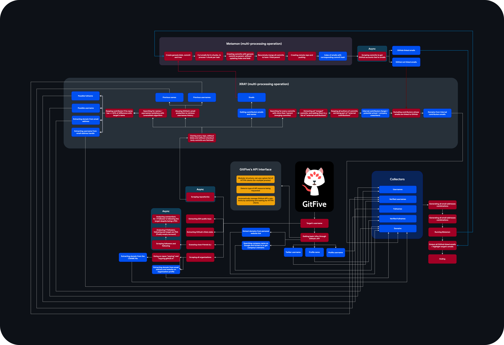

<br>


# GitFive - GitHub OSINT Tool

GitFive is an OSINT tool for investigating GitHub profiles, offering comprehensive reconnaissance capabilities with minimal API usage.

## Main Features

- Username/name history and variations tracking
- Email to GitHub account mapping
- Batch GitHub account discovery from email lists
- Target identity aggregation
- Repository analysis and cloning
- Email discovery and validation
- Local identity detection (UPNs)
- Secondary account detection
- SSH public key extraction
- JSON export capability

## Optimizations
- Efficient API usage (stays under rate limits)
- Multi-processing support (bypasses Python's GIL)
- Asynchronous scraping

## Prerequisites

- Git (latest version recommended)
- Python 3.11 or higher
- macOS, Linux, or Windows

## Installation Guide

### 1. Install Python 3.11
```bash
# macOS (using Homebrew)
brew install python@3.11

# Linux (Ubuntu/Debian)
sudo apt update
sudo apt install python3.11 python3.11-venv
```

### 2. Create and Activate Virtual Environment
```bash
# Create virtual environment
python3.11 -m venv venv_py311

# Activate virtual environment
# On macOS/Linux:
source venv_py311/bin/activate
# On Windows:
.\venv_py311\Scripts\activate
```

### 3. Clone and Install
```bash
# Clone the repository
git clone https://github.com/yourusername/GitFive.git
cd GitFive

# Install dependencies
pip install -r requirements.txt

# Install project in editable mode
pip install -e .
```

## Usage

1. **Authentication**: First, login to GitHub (preferably using a secondary account):
```bash
python main.py login
```

2. **Available Commands**:
```bash
# Track a GitHub user by username
python main.py user <username>

# Find user by email
python main.py email <email>

# Batch process email list
python main.py emails

# Quick email lookup
python main.py light <username>
```

## Troubleshooting

1. **ModuleNotFoundError: No module named 'httpx'**
- Ensure virtual environment is activated
- Run `pip install -r requirements.txt`
- Install project in editable mode: `pip install -e .`

2. **Python Version Issues**
- Verify Python version: `python --version`
- Ensure using Python 3.11 or higher
- Create new virtual environment if needed

3. **ImportError: No module named 'cgi'**
- This error occurs with Python 3.13
- Use Python 3.11 instead, which includes all required modules

4. **VS Code Integration**
- Select correct Python interpreter (Python 3.11)
- Ensure virtual environment is activated in terminal
- Install Python extension if needed

## Export Options

You can export results to JSON format:
```bash
python main.py user mxrch --json mxrch_data.json
```

## Workflow Visualization

**Click [here](https://raw.githubusercontent.com/mxrch/GitFive/master/assets/workflow.png) for a full view**

<br>



## Disclaimer

This tool is for educational purposes only. The author is not responsible for its use.

The use of this tool in an automated paid service/software is strictly forbidden without personal agreement.
Please use it only in personal, criminal investigations, or open-source projects.


*PS : plz avoid testing on torvalds or other authors of repos with 1 million commits*

📄 You can also use --json with user and email modules to export in JSON ! Example :

```bash
$ gitfive user mxrch --json mxrch_data.json
```

**Have fun 🥰💞**

## Video demo

https://github.com/mxrch/GitFive/assets/17338428/28a22d30-f651-483f-84e8-7fc6e00b831f

## Obvious disclaimer

This tool is for educational purposes only, I am not responsible for its use.

### Less obvious disclaimer

The use of this tool in an automated paid service / software is strictly forbidden without my personal agreement.\
Please use it only in personal, criminal investigations, or open-source projects.

## Thanks

- [novitae](https://github.com/novitae) for being my Python colleague
- [rayanlecat](https://twitter.com/rayanlecat), [ABH](https://twitter.com/ABHsec), [22sh](https://twitter.com/0x22sh), [BlackWasp](https://twitter.com/BlWasp_), [Tartofraise](https://twitter.com/_Tartofraise), [mpgn](https://twitter.com/mpgn_x64), [M3SS](https://twitter.com/0x4D335353) and [n1nj4sec](https://twitter.com/n1nj4sec) for the beta test
- The HideAndSec team 💗 (blog : https://hideandsec.sh)

## Sponsors

Thanks to these awesome people for supporting me !

<!-- sponsors --><a href="https://github.com/BlWasp"></a>&nbsp;&nbsp;<a href="https://github.com/gingeleski"></a>&nbsp;&nbsp;<!-- sponsors -->

\
You like my work ?\
[Sponsor me](https://github.com/sponsors/mxrch) on GitHub ! 🤗
